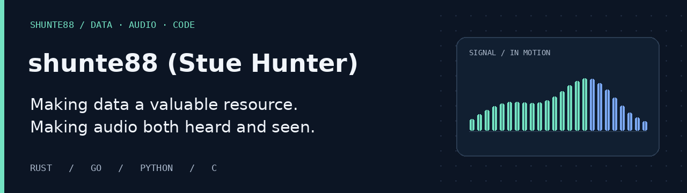

## Hi, I'm shunte88.

I build where **data, audio, and hardware meet** — from event-driven visualization servers to music displays powered by Rust and Go. A long-running curiosity for data, a keen ear for audio, and an eye for the details that make software useful.

**Hands-on:** `Rust` · `Go` · `Python` · `C` · `Linux` · `Raspberry Pi`

**Exploring:** AI & machine learning

### A few things I've built

| Project | What it brings together |
| :--- | :--- |
| **[vripr](https://github.com/shunte88/vripr)** | Rust and Audacity — vinyl digitization with track detection, Discogs metadata, and tagged export. |
| **[vcw](https://github.com/shunte88/vcw)** | Rust and integrated audio recording — a vinyl ripping workflow with its own recording head. |
| **[LyMonS](https://github.com/shunte88/LyMonS)** | Rust, OLED displays, and audio visualization — a music monitor with personality. |
| **[Vision On](https://github.com/shunte88/visionon)** | C and server-sent events — streaming playback metrics for audio visualization. |
| **[RGB Clock](https://github.com/shunte88/rgbclock)** | Go and Raspberry Pi — music, weather, and live information on RGB matrix displays. |

---

**Good data. Great sound. Thoughtful software.**

[Explore my repositories →](https://github.com/shunte88?tab=repositories)
